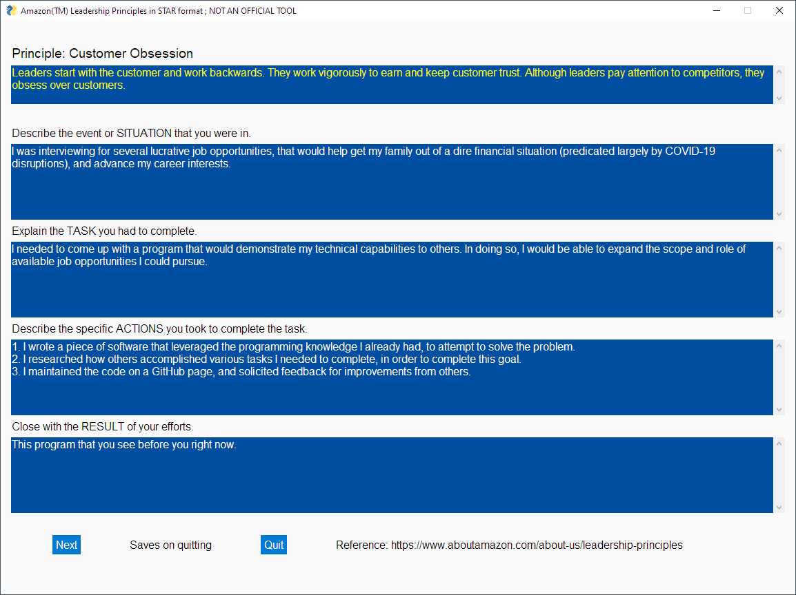

# starleader

## What is this?

starleader is my attempt to do two things...

1. Demonstrate to interviewers my ability to code things ad-hoc, for a particular need.
2. Be able to guide myself (and others) through an Amazon interview, using their STAR method. This may be useful for other jobs as well.

## Resources

- [Amazon Leadership Principles](https://www.aboutamazon.com/about-us/leadership-principles)
- [STAR Interview Response Technique](https://www.thebalancecareers.com/what-is-the-star-interview-response-technique-2061629)
- [Software license](https://choosealicense.com/licenses/apache-2.0/)
- [GUI library](https://pysimplegui.readthedocs.io/)

## How to use

1. Install [Python3](https://www.python.org/)
2. **pip3 install PySimpleGUI**
3. **src/starleader.py**

## Disclaimers

***WIP: Dec 8, 2020; data saves & loads via JSON. Still want to do an HTML or PDF export too.***

1. This isn't an Amazon tool.
2. I can't guarantee this will get any of us a job.
3. If something doesn't work right, you'll need to report an issue and/or submit a patch.

Thanks!!!
